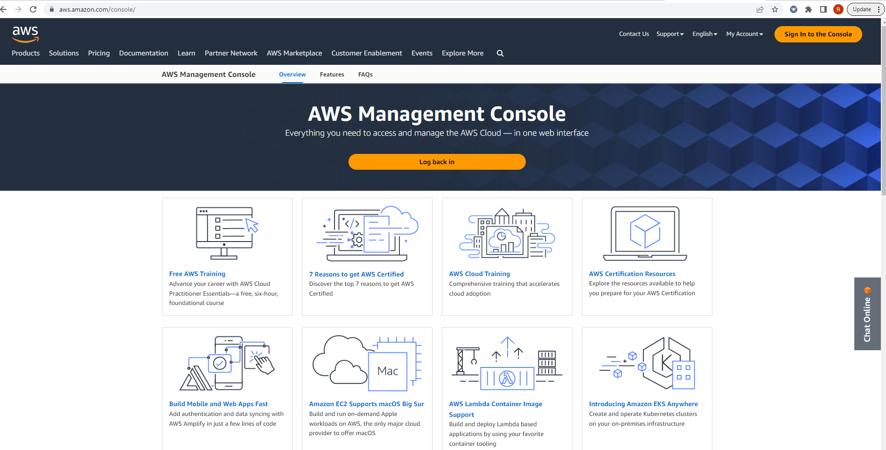
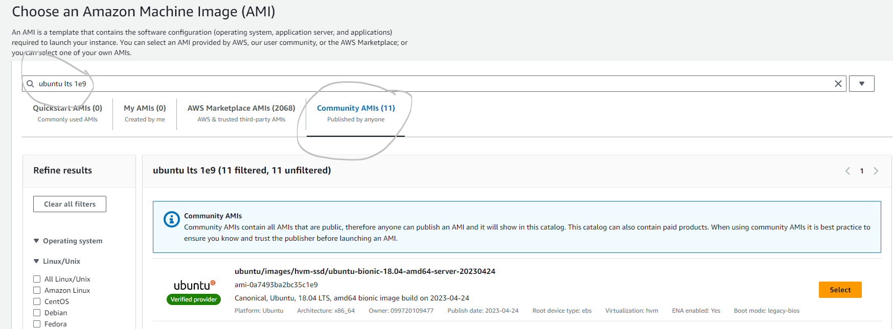
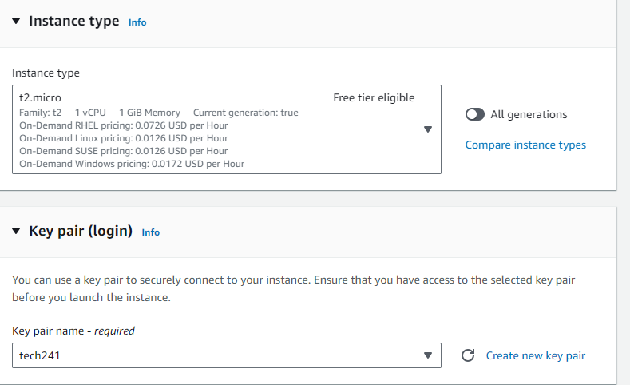
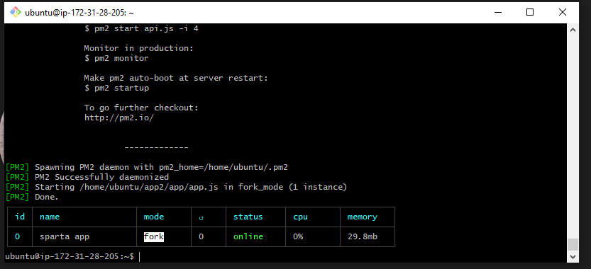
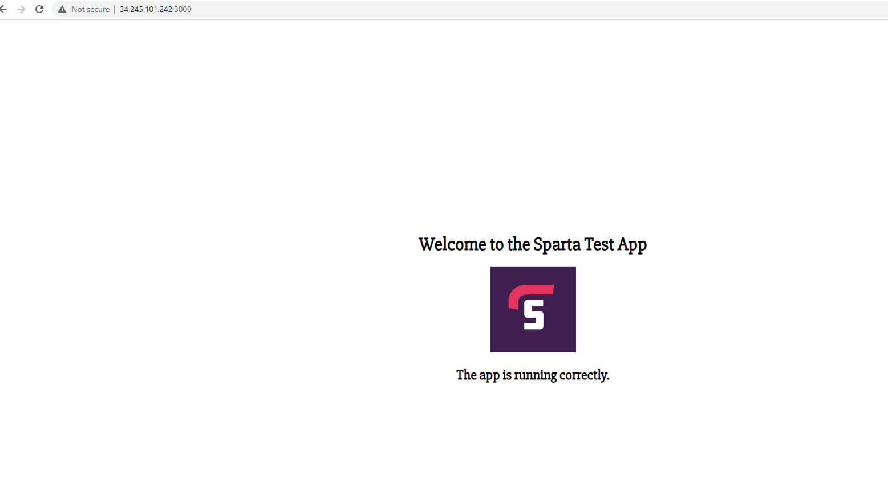
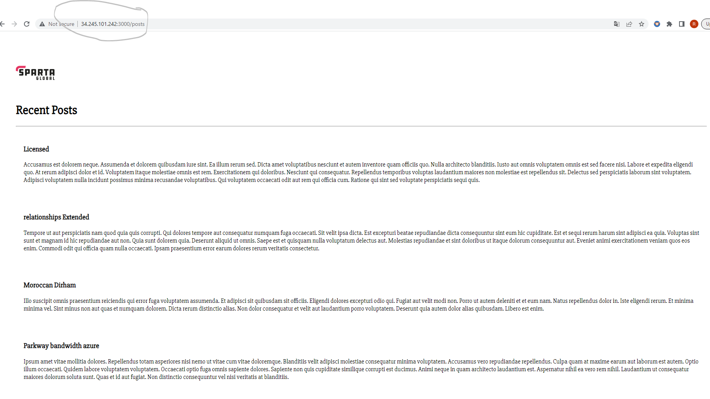

AWS intro

How to launch an EC2 instance?

1. Make an AWS account by following all the steps on the AWS.

2. Go to search bar and type in EC2. Make sure to choose your region. 

3. Go to instances and name your VM, Choose an OS image, Instance type, key pair and Security group.
   
 

Make sure that the instance state shows 2/2 checks passed. Click on connect then.

Follow these steps for DB_VM

Go to SSH Client. and select the path at the bottem of the page.

Open your Git Bash and add ssh -i "~/.ssh/<key name>"  

Go to nano.provision.sh and paste this script.

  If the commands have successfully run, you'll see this page.

  ](image-12.png)
  

    After you have entered APP_VM_Ip:3000 in the browser, this front page of sparta_app is visible.

  

  Connect to the App_VM using the same steps. But, run the app script.
  In the env variable, change MongoDb ip to your DB_VM_public Ip

  

  In your browser paste, your app_vm_ip:3000/posts

  

